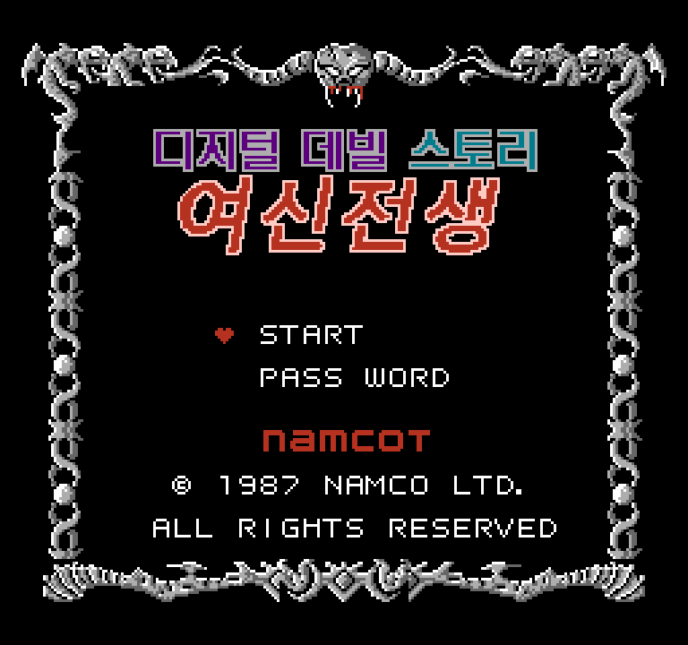
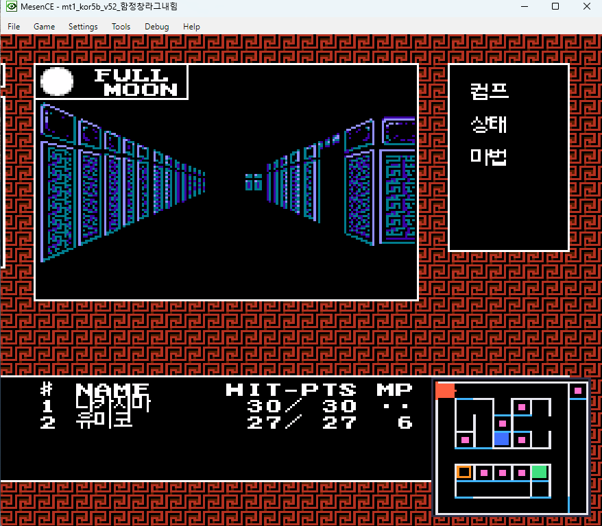
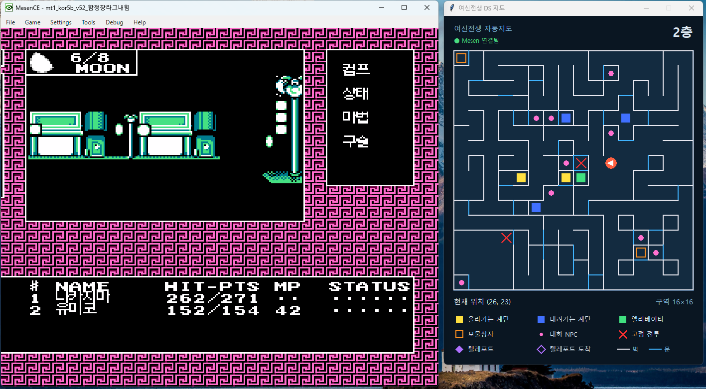

# 디지털 데빌 스토리 여신전생 (FC) 한글 패치 + DS 컨셉 자동지도

<p align="center">
  
</p>

1987년 패미컴판 『デジタル・デビル物語 女神転生』의 **비공식 한글 패치**와,
길찾기가 불편한 원작을 위한 **자동지도(두 번째 화면)** 도구입니다.

> ⚠️ **미완성·미검수 상태입니다 (v52).**
> - 대사는 모두 번역했고, **마왕 로키까지는 직접 플레이하며 검수**했습니다. 그 뒤로도 계속 검수하고 있습니다.
> - 검수가 번거롭고 오래 걸리는 작업이라, **검수가 다 끝나기를 기다리지 않고 먼저 공개**합니다.
>   플레이하다 어색한 번역이나 깨진 화면을 보면 알려 주시거나 직접 고쳐 주세요 → [기여 안내](CONTRIBUTING.md)
> - UI 쪽에 번역이 빠진 조각과 알려진 화면 문제가 남아 있습니다 → [3. 알려진 문제](#3-알려진-문제)

> 🤖 이 README 와 문서는 **AI(Claude)가 작성**했습니다. 번역 빌드 도구와 자동지도도 AI 와 함께 만들었습니다.

---

## 1. 패치 적용

| 항목 | 내용 |
|---|---|
| 패치 파일 | [`patch/MT1_Korean_v52.ips`](patch/) |
| 필요한 원판 | `Digital Devil Story - Megami Tensei (Japan).nes` — 262,160바이트, CRC32 `682C4603` (헤더 제외 `5393D949`) |
| 적용 결과 | 524,304바이트, CRC32 `0F0383D4`, 매퍼 195 |
| 권장 에뮬레이터 | **Mesen 2** (개발·검증에 사용) |

1. 원판 롬을 준비합니다. **이 저장소에는 롬이 없고, 롬 파일은 제공하지 않습니다.**
2. Lunar IPS, Flips, RomPatcher.js 같은 IPS 도구로 `MT1_Korean_v52.ips` 를 원판에 적용합니다.
3. 결과 CRC32 가 `0F0383D4` 인지 확인합니다 ([patch/CHECKSUMS.txt](patch/CHECKSUMS.txt)).

- 한글을 넣으려고 롬을 **매퍼 195 / 512KB** 로 늘렸습니다. 매퍼 195 를 지원하지 않는 에뮬레이터·실기에서는 돌지 않습니다
  (BizHawk 는 이 매퍼에서 멈추는 것을 확인했습니다).
- 옛 버전의 세이브스테이트는 새 버전에서 쓰지 마세요. 롬 안의 한글 처리 코드가 RAM 에 올라가 있어서 화면이 깨질 수 있습니다.

## 2. 자동지도 (DS 컨셉 두 번째 화면)

원판·영어판·한글판 **어느 롬에서나** 동작합니다. 롬을 고치지 않고 롬의 지도 데이터를 읽어서 그립니다.

**게임 화면 위에 작게 (Mesen 만)** — `automap.lua`
- Mesen → `Debug > Script Window` → [`automap.lua`](automap.lua) 열고 실행
- 키: `M` 켜기/끄기 · `N` 위치 옮기기 · `V` 표식 켜기/끄기 (X·Z 는 게임 키라 쓰지 않습니다)

<p align="center">
  
</p>

**별도 창에 크게 (DS 처럼)** — `ds_bridge.lua` + `mt1_ds_window.py`
1. Mesen Script Window 에서 [`ds_bridge.lua`](ds_bridge.lua) 실행
   (Script Window 설정에서 **네트워크 접근 허용**이 필요합니다)
2. `python mt1_ds_window.py <롬 파일>` — Python 3 기본 포함 tkinter 로 뜹니다

<p align="center">
  
</p>

표식: 올라가는/내려가는 계단 · 엘리베이터 · 보물상자 · 대화 NPC · 고정 전투 · **텔레포트 칸과 도착 칸**
- 텔레포트·계단·엘리베이터는 게임 코드로 뜻을 확인했습니다.
- 상자·NPC·고정 전투의 뜻은 [pareido.jp](https://pareido.jp/) 의 브라우저 에뮬레이터 지도에서 **단서**를 얻어 롬으로 형식을 검증한 것이고,
  게임 안에서 하나하나 확인하지는 않았습니다. 코드는 옮기지 않았습니다.

## 3. 알려진 문제

- **캐릭터 상태창에서 글자가 UI 창을 침범** — 초상화 틀·장식·아이콘이 한글 조각으로 바뀌거나 목록 줄이 겹칩니다.
  원인은 분석해 두었고(한글 동적 슬롯이 이 화면의 그림 타일과 같은 칸을 씀 / 한글 글자 높이), **당분간 그대로 둡니다.**
  자세한 내용: [`작업롬파일/VERSIONS.md`](작업롬파일/VERSIONS.md) 「알려진 문제」
- **번역이 빠진 UI 조각**: COMP 사용 불가 문구, 일부 마법 효과 문장의 앞부분, 흥정·돈 줍기 문장, 조사 한 글자 4곳 등.
  목록: `VERSIONS.md` 「미번역 점검」
- 오래 플레이하면 일부 그래픽 타일이 한글로 덮일 수 있습니다(같은 원인).

## 4. 직접 빌드하기

필요한 것: Python 3.12 + Pillow, Mesen 2.2.1 (검사용), 원판 롬

1. 원판에 [`patch/base_mt1_m191_v3.ips`](patch/) 를 적용해 **저장소 폴더에 `mt1_m191_v3.nes`** 로 저장합니다 (빌드 기준 롬, 플레이용 아님).
2. Mesen 위치: 저장소 **옆** 폴더 `Mesen_2.2.1_Windows` 에 두거나, 환경변수 `MESEN_DIR` 로 지정합니다.
3. 빌드 + 검사 10종:
   ```bash
   python make.py v53 내태그 --env MT1_M195=1
   ```
   결과는 `작업롬파일/` 에 생기고, 검사를 하나라도 통과하지 못하면 이름 뒤에 `_FAILED` 가 붙습니다.
   (기준선 롬과 명령 단위로 대조하는 락스텝 검사는 기준선 롬이 없으면 건너뜁니다)
4. 배포용 패치: `python make_ips.py <원판> <빌드한 롬> <출력.ips>` (만든 뒤 자동으로 재적용·일치 확인)

## 5. 폴더 구성

| 파일 | 내용 |
|---|---|
| `script_ko.txt` | 대사 342개 (원문 `JP:` + 번역 `KO:`) |
| `ui_ko.txt` `names_ko.txt` `ui_words.txt` `panel_ko.txt` | UI 문자열·이름표·라벨·던전 패널 |
| `static_font.txt` `galmuri/` | 정적 폰트 음절표, 갈무리 폰트 |
| `make.py` `build_step5b.py` … | 빌더와 검사 스크립트 |
| `automap.lua` `ds_bridge.lua` `mt1_ds_window.py` | 자동지도 |
| `docs/mt1-hangul-memory.md` | 설계·함정·인계 문서 (가장 자세한 기술 기록) |
| `작업롬파일/VERSIONS.md` | 버전별 변경·검증 기록 |
| `docs/claude-memory/` | 작업을 도운 AI(Claude)의 세션 간 메모 |

## 6. 라이선스 · 크레딧

- 코드(빌더·검사·자동지도 등): [MIT](LICENSE)
- 번역문과 한글 그래픽: [CC BY-NC-SA 4.0](LICENSE-TRANSLATION.md)
- 갈무리 폰트: © quiple, [SIL Open Font License 1.1](galmuri/README-LICENSE.md)
- 레이어 뜻의 단서: pareido.jp 브라우저 NES 에뮬레이터의 던전 자동지도

이 저장소는 원작과 무관한 **비공식 팬 번역**입니다. 원작 게임의 권리는 원저작권자에게 있습니다.
롬 파일은 포함하지 않으며, 롬 요청에는 응하지 않습니다.
