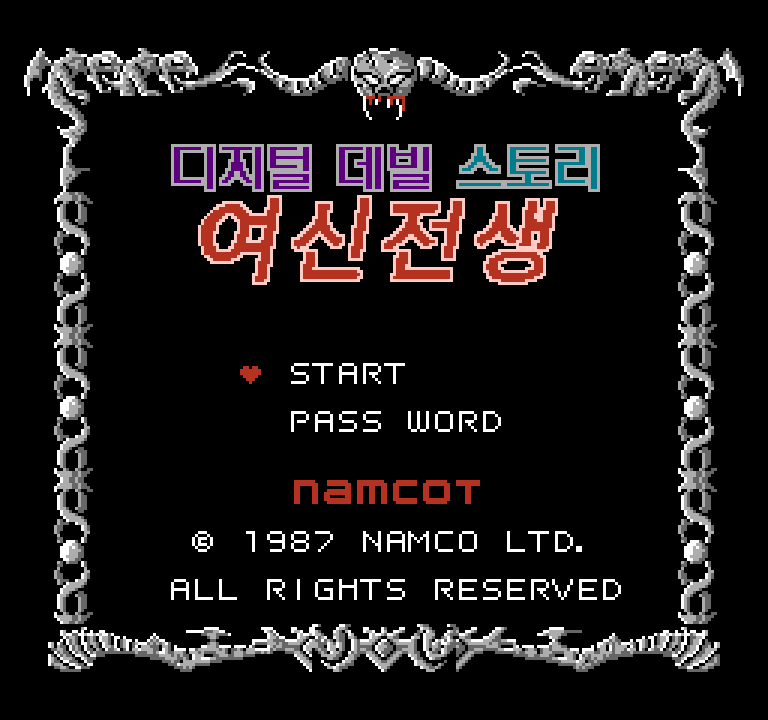
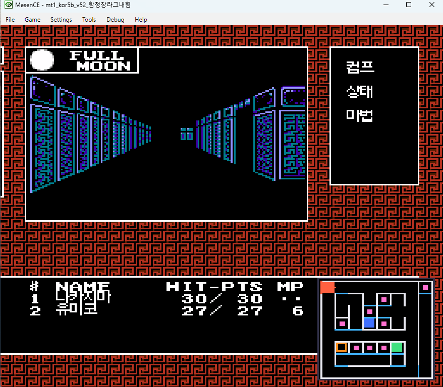
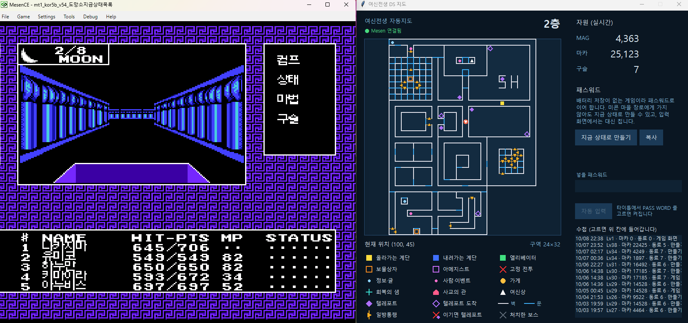

# 디지털 데빌 스토리 여신전생 (FC) 한글 패치 + DS 컨셉 자동지도

<p align="center">
  
</p>

1987년 패미컴판 『デジタル・デビル物語 女神転生』의 **비공식 한글 패치**와,
길찾기가 불편한 원작을 위한 **자동지도(두 번째 화면)** 도구입니다.

> ✅ **v54 — 엔딩까지 직접 플레이하며 검수했습니다.**
> - 대사는 모두 번역했고, 처음부터 엔딩(END 뒤 「그러나…」까지)을 실제로 플레이하며 검수했습니다.
> - 그래도 놓친 곳이 있을 수 있습니다. 어색한 번역이나 깨진 화면을 보면 알려 주시거나 직접 고쳐 주세요 → [기여 안내](CONTRIBUTING.md)
> - UI 쪽에 번역이 빠진 조각과 알려진 화면 문제가 남아 있습니다 → [3. 알려진 문제](#3-알려진-문제)

> 🤖 이 README 와 문서는 **AI(Claude)가 작성**했습니다. 번역 빌드 도구와 자동지도도 AI 와 함께 만들었습니다.

---

## 1. 패치 적용

| 항목 | 내용 |
|---|---|
| 패치 파일 | [`patch/MT1_Korean_v54.ips`](patch/) |
| 필요한 원판 | `Digital Devil Story - Megami Tensei (Japan).nes` — 262,160바이트, CRC32 `682C4603` (헤더 제외 `5393D949`) |
| 적용 결과 | 524,304바이트, CRC32 `E2091500`, 매퍼 195 |
| 권장 에뮬레이터 | **Mesen 2** (개발·검증에 사용) |

1. 원판 롬을 준비합니다. **이 저장소에는 롬이 없고, 롬 파일은 제공하지 않습니다.**
2. Lunar IPS, Flips, RomPatcher.js 같은 IPS 도구로 `MT1_Korean_v54.ips` 를 원판에 적용합니다.
3. 결과 CRC32 가 `E2091500` 인지 확인합니다 ([patch/CHECKSUMS.txt](patch/CHECKSUMS.txt)).

- 한글을 넣으려고 롬을 **매퍼 195 / 512KB** 로 늘렸습니다. 매퍼 195 를 지원하지 않는 에뮬레이터·실기에서는 돌지 않습니다
  (BizHawk 는 이 매퍼에서 멈추는 것을 확인했습니다).
- 옛 버전의 세이브스테이트는 새 버전에서 쓰지 마세요. 롬 안의 한글 처리 코드가 RAM 에 올라가 있어서 화면이 깨지거나 고친 부분이 적용되지 않습니다.
  이어 하려면 게임 안 패스워드(또는 아래 DS 창의 「지금 상태로 만들기」)를 받아 두고, 새 버전에서 리셋한 뒤 패스워드로 이어 하세요.

## 2. 자동지도 (DS 컨셉 두 번째 화면)

원판·영어판·한글판 **어느 롬에서나** 동작합니다. 롬을 고치지 않고 롬의 지도 데이터를 읽어서 그립니다.

**게임 화면 위에 작게 (Mesen 만)** — `automap.lua`
- Mesen → `Debug > Script Window` → [`automap.lua`](automap.lua) 열고 실행
- 키: `M` 켜기/끄기 · `N` 위치 옮기기 · `V` 표식 켜기/끄기 (X·Z 는 게임 키라 쓰지 않습니다)

<p align="center">
  
</p>

**별도 창에 크게 (DS 처럼)** — `ds_bridge.lua` + `mt1_ds_window.py`
1. Mesen Script Window 에서 [`ds_bridge.lua`](ds_bridge.lua) 실행
   (Script Window 설정에서 **네트워크 접근 허용**이 필요합니다)
2. `python mt1_ds_window.py <롬 파일>` — Python 3 기본 포함 tkinter 로 뜹니다

<p align="center">
  
</p>

표식: 올라가는/내려가는 계단 · 엘리베이터 · 보물상자 · 아메지스트 · 정보 · 사람 · 가게 · 회복의 샘 · 여신상 · 사교의 관 · 고정 전투 · **텔레포트 칸과 도착 칸**
- **일방통행**은 주황 화살표로 그립니다(게임은 지금 칸의 앞 면만 보므로, 한쪽만 벽인 경계는 한 방향으로만 지나갑니다).
- 보스 칸은 처치 여부를 따라 바뀝니다(로키 자리는 이기면 텔레포트가 됩니다). 진행에 따라 자리를 옮기는 가게·샘 등도 지금 상태에 맞게 그립니다.
- 별도 창 오른쪽에는 **MAG·마카·구슬 실시간 표시**와 **패스워드**(지금 상태로 만들기 · 입력 화면 자동 입력 · 수첩)가, 전투 중에는 적 정보 카드가 나옵니다.
- 텔레포트·계단·엘리베이터는 게임 코드로 뜻을 확인했습니다.
- 상자·NPC·고정 전투의 뜻은 [pareido.jp](https://pareido.jp/) 의 브라우저 에뮬레이터 지도에서 **단서**를 얻어 롬으로 형식을 검증한 것이고,
  게임 안에서 하나하나 확인하지는 않았습니다. 코드는 옮기지 않았습니다.

## 3. 롬 해석 공략 페이지

[`guide/index.html`](guide/index.html) — 롬 데이터를 직접 읽어 만든 공략 페이지입니다(내려받아 브라우저로 여세요).
층 지도 49장 · 랜덤 출현표(헤드리스 에뮬레이터 실측과 대조) · 고정 전투 · 악마 도감 · 장비·가게 · 합체·동료 · 마법 · 계산식 · 원작 버그.
- 배포판에는 **롬에서 뽑은 악마 그림을 넣지 않았습니다**(게임 그림이라서). 원판 롬과 Mesen 원판 필드 세이브스테이트가 있으면
  `python guide/capture_sprites.py` 로 그림을 뽑은 뒤 `python guide/make_guide.py <롬>` 으로 다시 만들 수 있습니다.
- 지역 이름·층 순서는 공략 사이트 dds.opatil.com 의 목차에 맞췄고, 그 사이트의 본문·그림은 옮기지 않았습니다.

## 4. 알려진 문제

- **번역이 빠진 UI 조각**: COMP 사용 불가 문구, 일부 마법 효과 문장의 앞부분, 돈 줍기 문장, 조사 한 글자 4곳 등.
  목록: [`작업롬파일/VERSIONS.md`](작업롬파일/VERSIONS.md) 「미번역 점검」
- 글이 그려지는 동안 한두 프레임 다른 글자가 비쳤다가 바로 고쳐지는 것은 한글 글자를 한 프레임에 한 칸씩 올리기 때문입니다.
- 캐릭터 상태창이 한글 조각으로 덮이던 문제는 v53 에서 고쳤습니다(상태창 16장·사교의 관을 원판과 대조). 오래 플레이한 뒤에도 깨지면 알려 주세요.

## 5. 직접 빌드하기

필요한 것: Python 3.12 + Pillow, Mesen 2.2.1 (검사용), 원판 롬

1. 원판에 [`patch/base_mt1_m191_v3.ips`](patch/) 를 적용해 **저장소 폴더에 `mt1_m191_v3.nes`** 로 저장합니다 (빌드 기준 롬, 플레이용 아님).
2. Mesen 위치: 저장소 **옆** 폴더 `Mesen_2.2.1_Windows` 에 두거나, 환경변수 `MESEN_DIR` 로 지정합니다.
3. 빌드 + 검사 10종:
   ```bash
   python make.py v55 내태그 --env MT1_M195=1
   ```
   결과는 `작업롬파일/` 에 생기고, 검사를 하나라도 통과하지 못하면 이름 뒤에 `_FAILED` 가 붙습니다.
   (기준선 롬과 명령 단위로 대조하는 락스텝 검사는 기준선 롬이 없으면 건너뜁니다)
4. 배포용 패치: `python make_ips.py <원판> <빌드한 롬> <출력.ips>` (만든 뒤 자동으로 재적용·일치 확인)

## 6. 폴더 구성

| 파일 | 내용 |
|---|---|
| `script_ko.txt` | 대사 342개 (원문 `JP:` + 번역 `KO:`) |
| `ui_ko.txt` `names_ko.txt` `ui_words.txt` `panel_ko.txt` | UI 문자열·이름표·라벨·던전 패널 |
| `static_font.txt` `galmuri/` | 정적 폰트 음절표, 갈무리 폰트 |
| `make.py` `build_step5b.py` … | 빌더와 검사 스크립트 |
| `automap.lua` `ds_bridge.lua` `mt1_ds_window.py` | 자동지도 |
| `guide/` | 롬 해석 공략 페이지와 생성기 |
| `docs/mt1-hangul-memory.md` | 설계·함정·인계 문서 (가장 자세한 기술 기록) |
| `작업롬파일/VERSIONS.md` | 버전별 변경·검증 기록 |
| `docs/claude-memory/` | 작업을 도운 AI(Claude)의 세션 간 메모 |

## 7. 라이선스 · 크레딧

- 코드(빌더·검사·자동지도 등): [MIT](LICENSE)
- 번역문과 한글 그래픽: [CC BY-NC-SA 4.0](LICENSE-TRANSLATION.md)
- 갈무리 폰트: © quiple, [SIL Open Font License 1.1](galmuri/README-LICENSE.md)
- 레이어 뜻의 단서: pareido.jp 브라우저 NES 에뮬레이터의 던전 자동지도

이 저장소는 원작과 무관한 **비공식 팬 번역**입니다. 원작 게임의 권리는 원저작권자에게 있습니다.
롬 파일은 포함하지 않으며, 롬 요청에는 응하지 않습니다.
